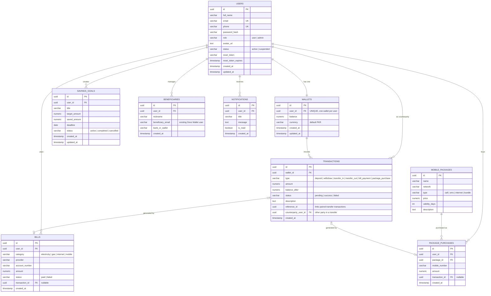

# Devs Wallet | Entity Relationship Diagram

The following Entity Relationship Diagram represents the PostgreSQL database schema defined in `server/migrations/schema.sql`.

## Relationship Notes

* **Users to Wallets (1:1):** `wallets.user_id` has a `UNIQUE` constraint. A wallet is created during user registration within the same database transaction.

* **Wallets to Transactions (1:N):** Each wallet can contain multiple transaction records. The `balance_after` field stores the wallet balance after each transaction.

* **Transfers:** A transfer creates two linked transaction records: `transfer_out` for the sender and `transfer_in` for the recipient. The records are connected using `reference_id` and are created within the same database transaction.

* **Users to Savings Goals, Bills, Package Purchases, and Beneficiaries (1:N):** Each record belongs to a specific user through its corresponding foreign key.

* **Bills and Package Purchases to Transactions:** The `transaction_id` fields connect bill payments and package purchases to their corresponding transaction records.

* **Mobile Packages to Package Purchases (1:N):** Mobile packages are stored in the package catalog, while purchases reference the selected package through `package_id`.

## Implementation Note

The `notifications` table is included in the database schema and therefore appears in the ERD. Notification API routes and user interface functionality are not currently implemented.
