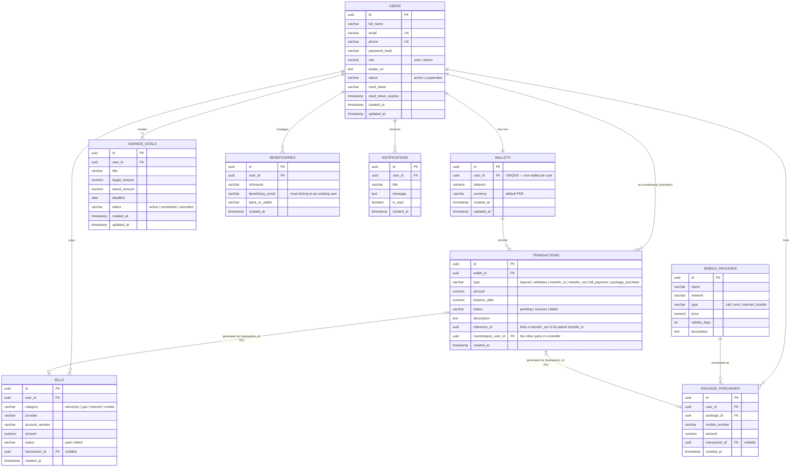

# Devs Wallet — Entity Relationship Diagram

This diagram is generated directly from `server/migrations/schema.sql` — every table, column, and relationship below exists in the actual database. Nothing here is aspirational.

## Relationship notes

- **users ↔ wallets (1:1)** — `wallets.user_id` has a `UNIQUE` constraint. A wallet is created in the same database transaction as the user record (`authController.register`), so a user can never exist without one.
- **wallets → transactions (1:N)** — every money movement writes one immutable row here, with `balance_after` stored as a running snapshot so history rendering never has to recompute balances.
- **Transfers** are two linked `transactions` rows: a `transfer_out` on the sender's wallet and a `transfer_in` on the recipient's, joined by `reference_id`, written atomically in one DB transaction (`walletController.transfer`).
- **users → savings_goals, bills, package_purchases, beneficiaries (1:N)** — standard ownership relationships, each scoped to the owning user in every query (no cross-user data leakage by construction).
- **bills.transaction_id / package_purchases.transaction_id** — each references the exact ledger entry it produced, giving a full audit trail from a bill payment or package purchase back to its transaction record.
- **mobile_packages → package_purchases (1:N)** — the catalog table is seeded with 4 rows at migration time (`schema.sql`); purchases reference a catalog entry by `package_id`.

## Known gap — `notifications` table

The `notifications` table exists in the schema (created by `schema.sql`) but **is not currently read or written by any controller or route** in this codebase — there is no `/api/notifications` endpoint and nothing inserts into it. It's included in the ERD for completeness since it is part of the live schema, but it should not be described as an implemented feature in the README or presentation. It's a natural next feature (e.g. wallet activity alerts) but is not functional today.

## Exporting as an image (optional)

If a `.png` is preferred for the submission alongside this Mermaid source:

1. Open this file on GitHub (Mermaid renders natively in `.md` files there), or paste the code block into the [Mermaid Live Editor](https://mermaid.live).
2. In the Live Editor, use **Actions → Export as PNG/SVG** to download `ERD.png`.
3. Save it as `docs/ERD.png` in the repository.

No image is generated automatically as part of this repo — the Mermaid source above is the source of truth; the PNG (if you add one) is just a rendered copy of it.
